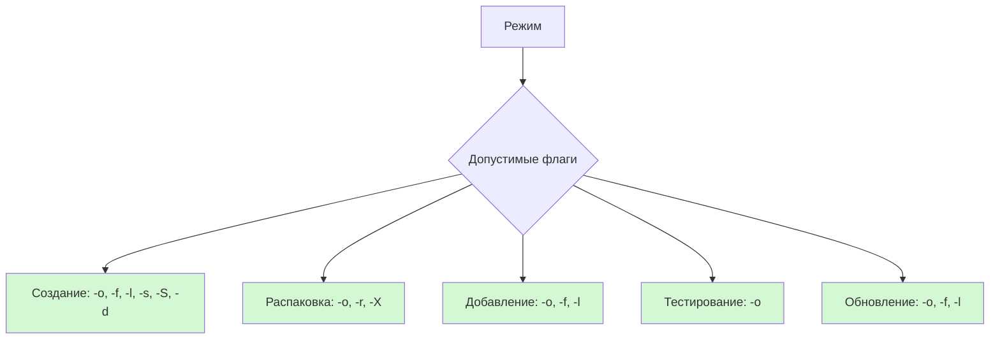

# Архиватор XArch: Справочник по режимам и флагам

---

## 1. Основные операции (обязательные и взаимоисключающие)

| Флаг               | Описание                 | Конфликты                                | Обязательные условия                  |
|--------------------|--------------------------|------------------------------------------|---------------------------------------|
| `-c`, `--compress` | Создание архива          | `-x`, `-a`, `-u`, `-T`                   | Требует `-f`, `-o`                        |
| `-x`, `--extract`  | Распаковка архива        | `-c`, `-a`, `-u`, `-T`, `-r`, `-d`, `-S` | Требует `-o` (имя архива)               |
| `-a`, `--append`   | Добавление в архив       | `-c`, `-x`, `-u`, `-T`                   | Требует существующий архив (например, `-o` existing.zip)               |
| `-u`, `--update`   | Обновление архива        | `-c`, `-x`, `-a`, `-T`                   | Требует `-o` (существующий архив)                |
| `-T`, `--test`     | Тестирование архива      | `-c`, `-x`, `-a`, `-u `                  | Требует `-o` (существующий архив)              |

---
## 2. Флаги, зависящие от операции

| Флаг | Описание                             | Допустимые операции | Ошибки                                                         |
|------|--------------------------------------|---------------------|----------------------------------------------------------------|
| `-f` | Файлы для создания/добавления архива | `-с`, `-a`, `-u`    | Требуется для `-c`, `-a`, `-u`. Бессмысленно с `-x`, `-T`      |                     
| `-o` | Распаковка/Тестирование архива       | Все операции        | Обязателен для всех режимов                                    |
| `-t` | Тип архива                           | `-с`, `-a`, `-u`    | Если формат не определяется автоматически, обязателен для `-x` |
| `-l` | Уровень сжатия                       | `-с`, `-a`, `-u`    | Бессмысленно с `-x`, `-T`                                      |
| `-p` | Пароль                               | `-с`, `-x`          | Для `-x` — если архив зашифрован                               |
| `-s` | Разделение на тома                   | `-с`                | Требует `-c`. При `-x` — все тома должны быть доступны         |
| `-X` | Исключение файлов                    | `-с`, `-a`, `-u`    | Бессмысленно с `-x`, `-T`                                      |
| `-r` | Сохранение структуры                 | `-с`, `-a`, `-u`    | Для `-x` — игнорируется                                        |
| `-d` | Удаление исходных файлов             | `-с`                | Только при успешном создании архива                            |
| `-S` | Создание SFX-архива                  | `-с`                | Бессмысленно с `-x`, `-T`                                      |

---

## 3. Примеры конфликтных комбинаций

| Комбинация                   | Проблема                                                  |
|------------------------------|-----------------------------------------------------------|
| `-c -x`                      | Невозможно одновременно сжимать и извлекать               |
| `-c -a`                      | Режимы `-c` (создать) и `-a` (добавить) взаимоисключающие |
| `-x -l 5`                    | Уровень сжатия (-l) не имеет смысла при извлечении        |
| `-T -f file.txt`             | Флаг -f (файлы) не нужен при тестировании архива (-T)     |
| `-c -o archive.zip (без -f)` | Обязательный флаг -f отсутствует                          |
| `-c -x`                      | Невозможно одновременно сжимать и извлекать               |
| `-s 100M (без -c)`           | Разделение на тома (-s) требует операции сжатия (-c)      |
| `-x -S`                      | Флаг SFX (-S) не имеет смысла при извлечении              |
| `-d (без -c)`                | Удаление файлов (-d) возможно только после архивации (-c) |

---

## 4. Матрица совместимости режимов и опций

| **Опция**               | `-c`<br>(Создание) | `-x`<br>(Распаковка) | `-a`<br>(Добавление) | `-u`<br>(Обновление) | `-T`<br>(Тестирование) |
|-------------------------|---------------------|-----------------------|-----------------------|-----------------------|-------------------------|
| **`-o, --output`**      | ✅ Обязателен      | ✅ Обязателен        | ✅ Обязателен        | ✅ Обязателен        | ✅ Обязателен          |
| **`-f, --files`**       | ✅ Список файлов   | ❌                   | ✅ Добавляемые файлы | ✅ Обновляемые файлы | ❌                     |
| **`-l, --level`**       | ✅ Уровень 0-9    | ❌                   | ✅ Уровень 0-9      | ✅ Уровень 0-9      | ❌                     |
| **`-s, --split`**       | ✅ Размер тома    | ❌                   | ❌                   | ❌                   | ❌                     |
| **`-d, --delete`**      | ✅ Удалить исходные | ❌                   | ✅ Удалить исходные | ✅ Удалить исходные | ❌                     |
| **`-S, --self`**        | ✅ SFX-архив      | ❌                   | ❌                   | ❌                   | ❌                     |
| **`-t, --type`**        | ✅ Формат архива  | ❌                   | ❌                   | ❌                   | ❌                     |
| **`-m, --method`**      | ✅ Алгоритм       | ❌                   | ✅ Алгоритм         | ✅ Алгоритм         | ❌                     |
| **`-p, --password`**    | ✅ Шифрование     | ✅ Расшифровка       | ✅ Шифрование       | ✅ Шифрование       | ✅ Проверка пароля     |
| **`-X, --exclude`**     | ✅ Исключить файлы| ✅ Исключить файлы   | ❌                   | ❌                   | ❌                     |
| **`-r, --preserve`**    | ✅ Сохранить пути | ✅ Сохранить пути    | ❌                   | ❌                   | ❌                     |

---

## Примеры корректного использования

### Создание архива
```bash
xarch -c -f "file1.txt img/" -o data.zip -l 9 -s 500M -S -p "secret"
```
## Разрешённые операции
### Базовые сценарии
1. **Создание архива**  
   `xarch -c -f file1.txt -o archive.zip`
2. **Распаковка**  
   `xarch -x -o archive.zip`
3. **Добавление файлов**  
   `xarch -a -o existing.zip -f newfile.txt`
4. **Проверка целостности**  
   `xarch -T -o archive.zip`
---
## Примеры комбинации

### Разрешённые
- Сжатие с максимальным уровнем:  
  `xarch -c -f data/ -o backup.zip -l 9 -s 500M`
- Распаковка с сохранением структуры:  
  `xarch -x -o backup.zip -r`

## Запрещённые операции
1. ❌ Комбинация режимов:  
   `xarch -c -x -o archive.zip`
2. ❌ Несовместимые флаги:  
   `xarch -T -o archive.zip -d`
3. ❌ Отсутствие обязательных параметров:  
   `xarch -c -l 5` (нет `-o`)

### Основные правила
1. **Только один основной режим** может быть активен за раз
2. `-h` (help) **несовместим** с другими режимами
3. `-o` (output) **обязателен** для всех режимов кроме `-h`

---


## Особые ограничения
### Для всех режимов:
1. ❌ Комбинация `-c -x -a -u -T`  
   *Причина:* Одновременное выполнение взаимоисключающих действий

2. ❌ `-s`/`--split` без указания размера  
   *Пример ошибки:* `xarch -c -s -o archive.zip`

3. ❌ `-l 10` (уровень сжатия вне диапазона)  
   *Ошибка валидации:* "Compression level must be 0-9"

### Режимозависимые ограничения:
| Ситуация                     | Режим   | Последствие                     |
|------------------------------|---------|---------------------------------|
| Указание `-f` при распаковке | `-x`    | Игнорируется — извлекаются все  |
| `-r` без `-x`                | Любой   | Предупреждение: флаг не активен |
| `-S` с существующим архивом  | `-c`    | Ошибка: SFX создаётся только для новых архивов |

---

## Визуальная карта совместимости



## Детализация режимов

### 1. Режим Compress (`-c`)
**Теория работы:**
- Собирает указанные файлы/папки в архив
- Применяет выбранный алгоритм сжатия
- Поддерживает разделение на тома

**Требуемые флаги:**
- `-f` / `--input` - входные файлы
- `-o` / `--output` - имя архива

**Опциональные флаги:**
- `-t` / `--type` - формат архива (по умолчанию: zip)
- `-l` / `--level` - уровень сжатия 0-9 (6)
- `-s` / `--split` - разделение на части (например, 100M)
- `-S` – создать SFX
- `-p` / `--password` - шифрование архива
- `-X` / `--exclude` - исключение файлов по шаблону

**Запрещённые/бессмысленные операции по режимам**

| Режим             | Запрещённые/бессмысленные флаги   | Причина                                                              |
|-------------------|-----------------------------------|----------------------------------------------------------------------|
| **Создание (-c)** | `-x`, `-a`, `-u`, `-T`            | Конфликт режимов: нельзя одновременно создавать и работать с архивом |
|                   | `--test`, `--extract`, `--update` | Несовместимые операции                                               |
|                   | `--append` без `-o`               | Требует указания существующего архива                                |

**Пример:**
```bash
xarch -c -f doc.pdf,images/ -o data.zip -l 9 -s 2G -S
```

### 2. Режим Extract (`-x`)

**Теория работы:**
- Извлекает файлы из архива
- Восстанавливает структуру директорий
- Проверяет контрольные суммы

**Требуемые флаги:**
- `-o` / `--output` - имя архива

**Опциональные флаги:**
-`p` / `--password` - пароль для расшифровки
-`r` / `--preserve` - сохранять структуру каталогов


| Режим               | Запрещённые/бессмысленные флаги    | Причина                                             |
|---------------------|------------------------------------|-----------------------------------------------------|
| **Распаковка (-x)** | `-c`, `-a`, `-u`, `-l`, `-s`, `-S` | Опции сжатия не применимы при извлечении            |
|                     | `--compress`, `--split`            | Противоречит цели распаковки                        |
|                     | `--delete` без успешной распаковки | Удаление возможно только после операции модификации |


**Пример**
```bash
./xarch -x -o archive.zip -rp "mysecret"
```

### 3. Режим Append(`-a`)

**Теория работы:**
- Добавляет новые файлы в существующий архив
- Не изменяет уже существующие данные
- Поддерживает шифрование
**Требуемые флаги:**
-`f` / `--input` - добавляемые файлы
- `-o` / `--output` - существующий архив
**Особенности:**
- Поддерживает те же опции, что и Compress
- Нельзя менять тип архива

| Режим               | Запрещённые/бессмысленные флаги     | Причина                                |
|---------------------|-------------------------------------|----------------------------------------|
| **Добавление (-a)** | `-c`, `-x`, `-u`, `-T`              | Эксклюзивная операция                  |
|                     | `--split`, `--self`                 | Нельзя менять структуру при добавлении |
|                     | `--output` без существующего архива | Требует указания актуального архива    |

**Пример**
```bash
./xarch -x -o archive.zip -p "mysecret"
```


### 4. Режим Update(`-u`)
**Требуемые флаги:**

-`f` / `--input` - обновляемые файлы
- `-o` / `--output` - архив для обновления
  **Отличия от Append:**
- Заменяет существующие файлы в архиве
- Проверяет контрольные суммы

| Режим               | Запрещённые/бессмысленные флаги | Причина                                   |
|---------------------|---------------------------------|-------------------------------------------|
| **Обновление (-u)** | `-c`, `-x`, `-a`, `-T`          | Конфликт задач                            |
|                     | `--test`, `--extract`           | Обновление ≠ верификация                  |
|                     | `--password` без `-p`           | Шифрование требует явного указания пароля |

  **Пример**
```bash
./xarch -x -o archive.zip -p "mysecret"
```

---
## Особые случаи ##
Самораспаковывающиеся архивы (-S)
- Работает только с -c
- Требует указания типа архива


```bash
./xarch -c -f *.txt -o backup.zip -p "secret" -l 9
```
2. Распаковка с сохранением структуры:

```bash
./xarch -x -o backup.zip -r -d /target/path
```

### Недопустимые команды ###
1. Конфликт режимов:

```bash
./xarch -c -x -o archive.zip # Ошибка: нельзя одновременно сжимать и распаковывать
```
2. Пропущены обязательные параметры:

```bash
./xarch -c -o archive.zip # Ошибка: не указаны файлы (-f)
```

### Примечания ###
1. Приоритет флагов:
При конфликте параметров (например, разные уровни сжатия) последний указанный флаг имеет приоритет

2. Логирование:
Используйте --verbose для вывода подробной информации о процессе

3. Специальные символы:
Для путей с пробелами используйте кавычки:
-f "My Documents/file.txt"

4. Поддерживаемые форматы:
ZIP, TAR, 7Z (список может расширяться)
---

### 5. Режим Test (`-t`) 
**Теория работы:**
- Проверяет целостность архива
- Верифицирует контрольные суммы
- Выводит список повреждённых файлов

**Обязательные флаги**
- ```-o``` -имя архива

| Режим                 | Запрещённые/бессмысленные флаги     | Причина                                    |
|-----------------------|-------------------------------------|--------------------------------------------|
| **Тестирование (-T)** | `-c`, `-x`, `-a`, `-u`              | Проверка целостности — автономная операция |
|                       | `--delete`, `--split`, `--self`     | Не влияют на проверку                      |
|                       | `--output` с несуществующим архивом | Невозможно проверить отсутствующий файл    |


**Пример**
```bash
xarch -T -o data.zip
```

---
### Валидация параметров ###

**Общие проверки**
1. Уровень сжатия ```0 <= -l <= 9```
2. Размер тома:
- Формат: ```Число[K|M|G] (e.g)```
- Минимум ```1K```
3. Тип архива ```zip, tar, 7z, rar```
### Краевые случаи ###
1. Пути файлов:
```bash 
xarch -c -f "file with spaces.txt" -o out.zip
```
2. Относительные пути:
```bash
xarch -c -f ../documents/ -o ~/backup.zip
```
3. Спецсимволы в пароле
```bash
xarch -c -f data -o secure.zip -p "P@ssw0rd!"
```

### Примеры использования ###

**Создание зашифрованного архива**
```bash
xarch -c -f secret_data.db -o vault.zip -p "my_password" -l 9 -S
```
**Распаковка с фильтрацией**
```bash
xarch -x -o backup.tar -X "*.tmp"
```
**Пакетное обновление**
```bash
xarch -u -o project.zip -f src/*.cpp include/*.h
```